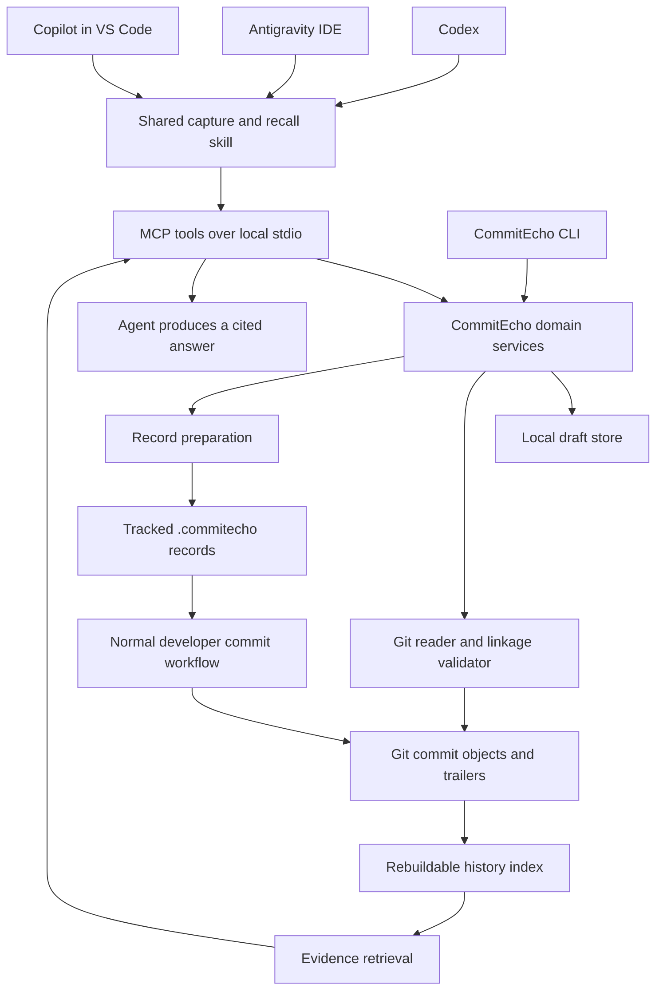
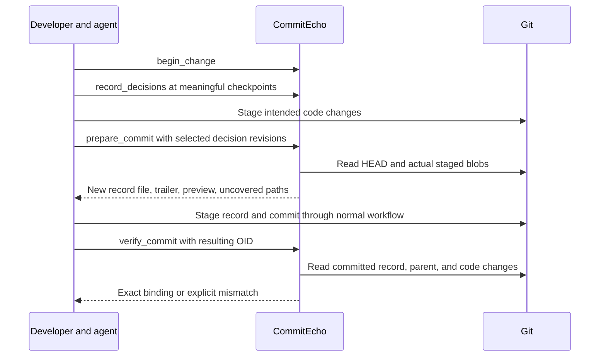

# CommitEcho architecture

Status: design baseline, reviewed against the v0.1.0 source on 2026-09-28. This document describes intended guarantees; [technical notes](technical-notes.md) describe implemented behavior and gaps.

## 1. Product contract

CommitEcho preserves discussion that explains a code change: the problem, chosen approach, alternatives actually considered, constraints, and reasons for changing an earlier approach. It attaches a compact record to Git history and returns evidence to a coding agent later.

Primary questions:

- Why did this function or file change?
- What alternatives did we consider, and why did we choose this approach?
- What decisions changed between revisions A and B?
- Did we previously try this, and what outcome did we record?
- What did the developer and another coding agent decide before this session?

The first release supports local Codex sessions, Antigravity IDE, and GitHub Copilot in VS Code. The shared contract is MCP tools plus instructions; host-specific setup is an adapter. Exact tested surfaces and versions belong in the integration matrix.

## 2. Invariants

1. No commit linkage is inferred solely from time proximity or matching filenames.
2. Matching a record to committed code does not prove that its explanation is true.
3. A proposal, a selected approach, and observed implementation are distinct states.
4. Alternatives and reasons absent from the available discussion remain unknown.
5. Committed records can be recovered from a normal clone without the original chat application or local database.
6. Historical answers are scoped to a Git revision or explicit commit set. A decision on another branch cannot silently become the current decision.
7. The server never needs hidden model reasoning. It records visible discussion, concise decision summaries, and supplied evidence.
8. Capturing memory does not authorize committing, pushing, or publishing it. The existing coding workflow controls those actions.
9. The baseline operates without transcript scraping, MCP sampling, embeddings, hooks, or a server-owned LLM.
10. Retries and multiple local clients cannot silently duplicate or overwrite records.

## 3. Components



| Component | Responsibility | Boundary |
| --- | --- | --- |
| Client adapter | Install configuration and instructions; report client/version/capabilities | No domain or retrieval logic |
| Shared skill | Decide when to checkpoint; summarize visible discussion; select relevant decisions before a commit; cite recall results | Instruction following is best effort |
| MCP transport | Validate tool inputs, expose tools, return bounded structured output | No direct Git or SQL logic |
| Domain services | Changes, decision revisions, source labels, record preparation, idempotency | Usable identically by MCP and CLI |
| Git adapter | Read actual objects/index; resolve refs; inspect changes; verify record bindings | Arguments passed without a shell; no arbitrary command endpoint |
| Local store | Durable private drafts and a separate rebuildable history index | Drafts cannot be reconstructed from Git until exported and committed |
| Retrieval | Scope by repository/revision, find records, return evidence and limitations | Does not generate explanations |

Recommended stack: Python 3.12+, official MCP Python SDK, typed validation models, Python SQLite with FTS5, and the installed Git executable. Pin the SDK version and protocol behavior during the first compatibility spike. The [official SDK](https://github.com/modelcontextprotocol/python-sdk) supports server development; [Python's SQLite interface](https://docs.python.org/3/library/sqlite3.html) avoids requiring a separate database service.

Use one Python package with clear modules, not services. Stdio processes are launched by each client. Each process opens the same repository-local store where appropriate. No daemon or HTTP deployment is required for v0.1.

## 4. Portable capture

The agent already has the discussion in context. It sends a concise structured checkpoint through an MCP tool when a meaningful decision is made, revised, rejected, or implemented. It also checkpoints before preparing a commit and before handing work to another agent.

A short persistent instruction activates this workflow. A skill provides its detailed steps. Users can explicitly invoke the workflow if automatic use fails. Native lifecycle hooks are optional improvements after the baseline passes in all three clients; a hook event does not inherently contain the whole conversation or perform summarization.

Capture should take place during work. Waiting until the end risks losing earlier discussion to context compaction. Do not store a transcript for every edit or repeatedly regenerate every prior decision.

First-release capture inputs:

- A developer request or constraint, summarized with its origin labeled.
- The selected approach and its reason.
- Only alternatives that were actually discussed, with their recorded disposition.
- Affected repository-relative paths and optional code locations.
- Known outcomes and test evidence, labeled by how they were obtained.
- A connection to an earlier decision if the new change revises it.

The server cannot prove that an agent faithfully summarized a conversation it cannot independently read. It labels such material `agent_reported`. A quotation supplied by the same agent is still agent-reported unless a supported source adapter independently resolves it. Developer confirmation, when explicitly given, is a separate attestation, not a mandatory gate on every checkpoint.

An agent's statement that "the user confirmed this" remains agent-reported. A direct developer attestation needs an explicit CLI/UI action tied to the record revision. Hashes establish content identity, not authorship or authenticity.

## 5. Domain model

| Entity | Essential fields | Meaning |
| --- | --- | --- |
| Repository | Local installation ID; Git common directory; optional portable project ID | Local isolation; a remote URL alone is not identity |
| Session | CommitEcho session ID, client, optional native session ID, worktree ID | Several sessions can contribute to one change |
| Change | UUID, title, starting revision, worktree, contributing sessions, revision counter | Unit of ongoing work; may result in several commits |
| Decision revision | Decision UUID, revision UUID, predecessor revision IDs, problem, choice, rationale, alternatives, disposition | Immutable revision of a decision once recorded |
| Evidence | ID, kind, content or locator, origin, observed time, verification method | What supports an individual statement |
| Code scope | Paths; optional base blob and line ranges; agent-supplied symbol label | Scope of a statement, not proof of causation |
| Commit record | UUID, change ID, selected decision revisions, evidence, code-change fingerprint | Portable snapshot prepared for one code commit |
| Binding | Record ID, full commit OID, validation result, method, diagnostic details | How a record is related to a commit |

Decision disposition is `proposed`, `selected`, `rejected`, or `withdrawn`. Implementation and test observations are separate fields; code being committed does not mean a proposal was chosen or tested.

Revisions use UUIDs and explicit predecessor links, not a global revision number. This permits two branches to revise the same decision independently. A superseding revision is effective only where its associated commit is reachable. Concurrent incompatible revisions remain a visible conflict until a later revision resolves them.

A record can contain several decisions. A decision can appear in several records. Several agents can contribute evidence to a decision. No one-to-one assumption between session, decision, and commit is allowed.

## 6. Storage and ownership

### Private working data

Store private state under `<git-common-dir>/commitecho/`:

```text
commitecho/
  drafts.sqlite       # authoritative local, uncommitted work
  index.sqlite        # disposable projection of committed records
```

Resolve the common directory and worktree directory through Git, including linked worktrees where `.git` is a file. Assign worktree-specific context to each pending change. Never use a process-global "current change" shared by all clients.

Use transactions, foreign keys, short writes, optimistic change revisions, and idempotency keys. Enable WAL on supported local filesystems with a bounded busy timeout. SQLite still serializes writers; [WAL also requires suitable same-host filesystem behavior](https://sqlite.org/wal.html). Network filesystem storage is outside v0.1 support. Store recreation rebuilds the history index only; private drafts need an explicit export/backup path.

### Committed memory

Place portable records in the repository:

```text
.commitecho/
  config.json
  records/
    <record-uuid>.json
```

Each file is a bounded, readable, versioned JSON record. Include only the selected decision summaries and shareable evidence. Local transcript paths, account IDs, and full chats are not part of the portable format by default.

Add a trailer to the code commit:

```text
fix: deduplicate retried uploads by content

CommitEcho-Record: 3ef6b6f8-a1de-4b82-bb32-6356df4daa51
```

[Git trailers](https://git-scm.com/docs/git-interpret-trailers) provide a structured pointer. The referenced file is included in that commit's tree. The record does not embed its own containing commit's SHA, avoiding a circular hash dependency. The index derives the backlink from the actual Git object.

Prepared files become authoritative shared history only once committed. Their local preparation metadata remains draft state. Published record content is append-only by application convention; corrections create new records referencing the old ones. CommitEcho reads committed versions by object ID, so an edited working-tree copy cannot silently replace historical evidence.

Ordinary clone/push/pull carries the files and trailers. JSON changes are reviewable in a PR. This adds small files to repositories; that is a deliberate v0.1 tradeoff for portability. A single record is limited to 64 KiB, with 4 KiB of inline content per evidence item.

### Why not Git notes as the primary store?

[Git notes](https://git-scm.com/docs/git-notes) can attach metadata without changing the annotated object. They are a valid future backend, but require a separate ref-sharing and conflict workflow. Supporting two authoritative publication backends initially would multiply failure cases. v0.1 uses tracked records; optional notes export can come later.

Retrospective enrichment is deferred. Its future format should distinguish the recording commit from the earlier target commit and label reconstructed intent as inferred. It must not pretend the record existed at the target revision.

## 7. Commit preparation and linkage



Preparation must inspect the staged index, not every file the agent touched. Partial staging is therefore supported. The agent explicitly selects the decisions relevant to this commit, and the server reports changed paths with no selected decision scope.

The code fingerprint is a versioned SHA-256 digest of a canonical change manifest. For each changed non-record path, the manifest contains the raw path encoded losslessly, old/new object IDs, and old/new modes. Sort deterministically and encode a documented byte representation. Disable rename detection when building it: a rename is delete plus add. This handles binary blobs and file modes without depending on a pretty diff's formatting.

Exclude only generated `.commitecho/records/**` from this code fingerprint. Configuration, source, and other documentation remain ordinary changes. Record the expected parent OID (or an explicit root-commit marker), repository object format, manifest version, and digest. Freeze the staged tree for comparison; recheck HEAD/index while preparing and return `INDEX_CHANGED` if the snapshot moves.

`prepare_commit` writes only the new record file, returns its path and trailer, and does not stage or commit files. It uses atomic file creation, refuses collisions with different bytes, and rejects symlinks escaping the repository. A failed write/DB update can be retried with the same operation ID and recovered from the recorded digest.

`verify_commit` evaluates three independent facts:

1. **Declaration:** the commit carries the record trailer, and the record exists at its expected path in that commit's tree.
2. **Integrity:** the schema, record ID, and content are valid; a reused UUID with different content is a conflict.
3. **Code match:** the actual parent and code-change manifest match the prepared values.

Only all three produce `exact`. This verifies which code the explanation was prepared for. It does not authenticate the author or validate the truth of their rationale.

Binding outcomes are `exact`, `declared_changed`, `contained_only`, `unverifiable`, and `invalid`. A record present in a tree without a trailer is `contained_only`; its presence alone does not attach it to every descendant commit. Missing parent objects or other incomplete history produce `unverifiable`, not a false integrity failure. Index record introduction and explicit references, not every repeated file occurrence.

A crash after Git commits but before verification is recoverable by indexing committed objects. A failed commit leaves the draft and prepared file available. After staged code changes, generate a new record or discard the uncommitted preparation; do not silently reuse the old fingerprint.

v0.1 prepares ordinary single-parent and root commits. It can read merge history, but preparing a new merge-resolution explanation needs an explicit parent/combined-change policy and is deferred.

## 8. MCP surface

All tools operate within an explicitly configured allowed repository/worktree. They do not accept arbitrary filesystem roots or SQL. These eight tool names are implemented. Some output fields and guarantees below remain design targets; see [technical notes](technical-notes.md).

| Tool | Essential input | Output and behavior |
| --- | --- | --- |
| `begin_change` | Title, client/session identity, optional prior change ID | Change/session IDs, observed base OID, current revision |
| `record_decisions` | Change ID, expected revision, operation ID, decisions and evidence | Persisted revision IDs and updated change revision; no Git writes |
| `prepare_commit` | Change ID, expected revision, selected revisions, operation ID | Record path, suggested trailer, staged-scope preview, uncovered paths |
| `verify_commit` | Full/resolvable commit OID, optional record ID | Binding status and precise reasons; refreshes local index |
| `search_history` | Question and/or path/line, `at_ref` or range, pagination | Ranked records, evidence IDs, scope and coverage |
| `get_evidence` | Record/evidence ID and historical location | Bounded source material, provenance, resolvable citation |
| `compare_history` | `from_ref`, `to_ref`, optional path | Decision revisions and recorded changes within the defined Git range |
| `get_status` | Optional change ID | Pending changes, stale preparations, indexing coverage, setup capability |

`begin_change` is idempotent for a supplied operation ID as well. Every mutation uses a caller-generated operation ID scoped to the repository, rejects reuse with different payloads, and supports optimistic conflict reporting. Every response contains a schema version and structured error/coverage fields. Reads return bounded lists with cursors and explicit truncation.

CLI status is backed by explicit change state: `open -> prepared -> committed`, with `abandoned` for unfinished work. A multi-commit change can return to `open` for its next record; already committed records are immutable. New decision checkpoints invalidate a preparation only if they change one of its selected revisions. Git index/parent changes independently invalidate the code match.

The CLI implements `init`, `doctor`, `status`, `index`, `show`, `diff`, `verify`, draft `export`, and `setup`. Capture and prepare are available through MCP tools. No independent CLI implementation of business rules. Optional hooks later call deterministic CLI operations; stdout from an MCP process is reserved for protocol messages.

## 9. Retrieval and temporal semantics

The first index uses SQLite FTS5 for lexical search, plus exact indexes over commit OIDs, record IDs, decision IDs, and paths. The host agent can reformulate natural-language questions into several terms. Embeddings are an extension only if an evaluation shows lexical retrieval misses useful paraphrases.

Keep bindings and rationale provenance separate in results. Malformed records are excluded from explanatory results and listed as diagnostics. Weaker bindings can be returned as related context, clearly labeled; they cannot silently supersede a valid decision for an exact code question. Stored history is evidence for the current agent to consider, not an instruction that overrides the developer's current request.

Retrieval pipeline:

1. Resolve the repository, worktree, and requested refs to immutable OIDs.
2. Determine the reachable commit set and indexing completeness.
3. For a file/line question, inspect blame and relevant file history. For a range, enumerate its commits. For text, retrieve candidate decision records.
4. Apply repository and ancestry filters before returning results; rank exact bindings ahead of weaker matches.
5. Expand the selected decision's predecessor/supersession records within the requested history.
6. Return source material, link methods, unknowns, and immutable citations. The connected agent composes the answer.

Default `at_ref` is the worktree's captured HEAD. Record both the ref requested and the resolved OID. `A..B` means commits reachable from B excluding those reachable from A; it excludes A. It is not a date interval. If A is not an ancestor of B, the response exposes that fact and the merge base. See [Git revision traversal](https://git-scm.com/docs/git-rev-list).

`compare_history` returns changes introduced in that set, plus clearly labeled predecessor context when needed. An optional first-parent view must be explicit. "As of A" must not use a later decision revision or annotation. Dates describe when statements were captured; ancestry controls which published decisions are visible.

Index immutable commit objects incrementally; recompute reachability when refs move. Deleting a record in a later commit does not erase its historical existence. Detached HEAD and branches use the same ancestry rules. A shallow clone, missing object, interrupted index, or result limit produces `coverage: partial` with reasons.

For function questions, v0.1 accepts the file and line range that the host agent resolves from code. Symbol names are search hints. Following a symbol across arbitrary languages, renames, moves, and rewrites is outside the initial correctness promise. Blame locates a modification; it does not prove the complete reason the code exists.

Evidence citations include full commit OID, repository-relative record path, and evidence/decision ID; code citations include blob OID and line range. CLI output supplies a local inspection command. A supported web remote may additionally provide a commit/blob link. No permanent public URL is assumed for local repositories or private source chats.

## 10. Failure and concurrency behavior

| Situation | Required behavior |
| --- | --- |
| Agent never checkpoints | Report no recorded rationale; no guarantee of complete capture |
| Original discussion compacted | Keep prior checkpoints; label gaps rather than reconstructing imagined alternatives |
| Two agents share a worktree | Distinct sessions/changes and optimistic revisions; refuse a moved index; cannot claim to prevent arbitrary concurrent Git writes |
| Two worktrees share a repository | Shared committed-history index; worktree-specific pending state and preparation |
| Partial staging | Bind to actual staged blobs; flag uncovered scope; do not claim a decision applies to unstaged code |
| Amend, rebase, or cherry-pick | Re-evaluate each resulting commit; preserve explicit references but downgrade parent/code mismatches |
| Squash merge | Records may survive but trailers/fingerprints can change; show retained context with weaker linkage, never silently relabel it exact |
| Contradictory branch decisions | Return both branch-local revisions and unresolved conflict after merge |
| Same record ID with changed bytes | Integrity conflict; do not pick the latest timestamp |
| Agent reports a test passed | Label agent-reported unless a supported artifact independently establishes the result |
| Client/server restart | Durable draft transaction survives; published index can be rebuilt |
| Copied repository with same project ID | Keep local installations isolated; no automatic cross-repository trust or database sharing |

Automatic rewrite reconciliation and squash repair are later features. v0.1 must detect degraded linkage reliably rather than promise every Git operation preserves exact attribution.

## 11. Data handling

The server stores local summaries by default. Initial setup explains that preparing a record makes its selected contents eligible for inclusion in the repository's normal commits. The agent shows the compact prepared summary as part of its ordinary commit report; a separate approval loop for every decision is unnecessary.

Allow field/path exclusions and redact recognized credentials before preparing portable content. Redaction is best effort, not a guarantee. The exported summary itself must remain useful when a private source link is unavailable on another machine. Optional transcript import will need a specific source and scope; it is not an implicit scan of all chats.

Treat imported evidence and repository content as data, never executable instructions. Sanitize tool output, bound payloads, and keep filesystem access inside configured roots. Read Git diffs without external diff/textconv helpers. Do not auto-fetch network remotes or execute repository hooks during read operations.

## 12. Implementation shape

```text
src/commitecho/
  domain/         # decision revisions, evidence, records, bindings
  application/    # capture, prepare, verify, retrieve, compare
  git/            # discovery, object reads, manifests, ancestry
  storage/        # drafts, history index, migrations, FTS
  transports/     # MCP tool schemas and CLI
  integrations/   # declarative client profiles and setup generation
tests/
  fixtures/       # real tiny Git repos with known decisions
  integration/    # Git lifecycle and MCP contract checks
  evals/          # capture/recall tasks and expected evidence
```

The current export is serialized from Pydantic models with a schema version. The versioned migration and future-schema behavior described above remain design goals. The canonical manifest currently uses sorted JSON fields and SHA-256 in `git/adapter.py`.

## 13. Worked example

This is an illustrative subset of the wire record; generated timestamps and optional null fields are omitted. Angle-bracket values stand for server-generated IDs and real Git object identifiers.

```json
{
  "schema_version": 1,
  "record_id": "<record-uuid>",
  "change_id": "<change-uuid>",
  "summary": "Prevent duplicate uploads when a retry uses a different filename.",
  "prepared_for": {
    "parent_oid": "<full-parent-oid>",
    "object_format": "sha1",
    "manifest_version": 1,
    "code_manifest_sha256": "<digest-computed-by-server>"
  },
  "decisions": [
    {
      "decision_id": "<decision-uuid>",
      "revision_id": "<revision-uuid>",
      "predecessor_revision_ids": [],
      "disposition": "selected",
      "problem": "Filename identity misses retries that rename the same content.",
      "choice": "Deduplicate using a content hash before queue submission.",
      "rationale": "The same uploaded content must create only one ingestion job.",
      "alternatives": [
        {
          "choice": "Deduplicate by filename",
          "disposition": "rejected",
          "reason": "A renamed retry would bypass it.",
          "evidence_ids": ["e1"]
        }
      ],
      "code_scope": {"paths": ["src/uploads.py"]},
      "evidence_ids": ["e1"]
    }
  ],
  "evidence": [
    {
      "evidence_id": "e1",
      "kind": "discussion_summary",
      "origin": "agent_reported",
      "client": "codex",
      "content": "We discussed renamed retries and selected content identity over filename identity."
    }
  ]
}
```

Months later, a range query returns this record at commit A and a later revision at commit B that changes the approach. The agent can explain the recorded change in requirements, cite both commits and records, and identify the earlier alternative. If there is no later reason in the evidence, it can show the code difference and say the reason was not recorded.
